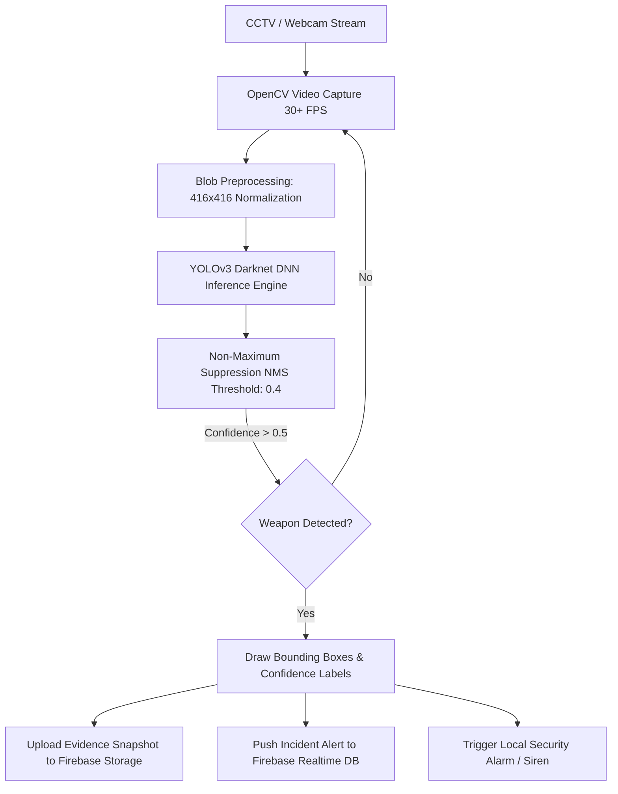

# 🛡️ Real-Time Edge Computer Vision Weapon Detection System

[](https://www.python.org/)
[](https://opencv.org/)
[](https://pjreddie.com/darknet/yolo/)
[](https://firebase.google.com/)
[](LICENSE)

An intelligent edge security surveillance engine that detects firearms, knives, and weapons in real-time video feeds using deep neural networks (YOLOv3 / Darknet via OpenCV DNN). Upon threat detection, it instantly triggers security alarms, stores image evidence in Firebase Cloud Storage, and syncs incident logs to Firebase Realtime Database.

---

## 🏛️ System Architecture



---

## ✨ Features

- **⚡ Real-Time Object Detection:** Deep neural network inference utilizing OpenCV's optimized C++ DNN module with GPU/CPU acceleration.
- **🎯 Non-Maximum Suppression (NMS):** Eliminates overlapping bounding boxes and suppresses low-confidence background noise.
- **☁️ Cloud Incident Synchronization:** Integrates with `Pyrebase` to automatically stream incident timestamps, camera IDs, and high-res evidence snapshots to Firebase.
- **🔔 Edge Alerting:** Sub-second latency from detection to cloud alert broadcast for home security dashboards and mobile clients.

---

## 📂 Repository Contents

```
weapondetection/
├── weapon_detection.py    # Main detection loop, inference engine & Firebase sync
├── yolov3_testing.cfg     # Darknet YOLOv3 network topology & anchor specifications
├── img.png                # Sample validation and inference snapshot
└── README.md              # Project documentation
```

---

## 🚀 Setup & Execution

### Prerequisites
- Python 3.8+
- Webcam or IP Camera stream (RTSP/HTTP)

### 1. Installation

```bash
# Clone the repository
git clone https://github.com/abhay2008/weapondetection.git
cd weapondetection

# Setup environment
python3 -m venv .venv
source .venv/bin/activate
pip install opencv-python numpy pyrebase4
```

### 2. Download Model Weights
Download the pre-trained `yolov3.weights` or custom-trained `yolov3_weapon.weights` file and place it in the project root:
```bash
# Example weight file download
wget https://pjreddie.com/media/files/yolov3.weights
```

### 3. Run Weapon Detection

```bash
python weapon_detection.py
```

---

## 👨‍💻 Author

**Abhay Kashyap**
- GitHub: [@abhay2008](https://github.com/abhay2008)
